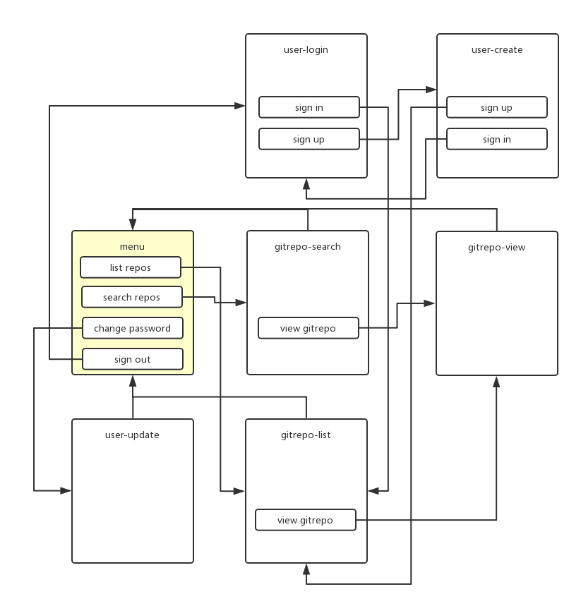

# golang github trending demo app

## 界面样例


## 界面流程

- 界面跳转流程图如下：



## 服务架构

- 服务分为五个模块，架构图如下图：

  

  - 前端界面（frontend-svc）：用户操作的前端webapp

  - 后端服务（backend-svc）：这是一个后端服务的反向代理，frontend-svc所有请求都指向backend-svc，backend-svc再把请求forward给对应的服务。

  - 用户管理服务（user-svc）：用于管理用户信息，包括新用户注册、用户登录、修改密码、注销等业务逻辑。

  - 项目管理服务（gitrepo-svc）：用于管理开源项目信息。当用户发起搜索请求的时候，gitrepo-svc调用github的developer api，获取项目列表，并写入到数据库，然后返回项目列表给用户。当用户发起列表请求的时候，gitrepo-svc从数据库获取项目列表返回给用户。当用户查看某个项目的时候，gitrepo-svc调用review-svc，获取评论信息和项目信息返回给用户。

  - 评论管理（review-svc）：用于管理评论信息，包括创建和删除评论，以及获取评论列表。

## 微服务部署模式设计

- 如下图所示，微服务的所有实例在kubernetes容器云中都是以多副本的形式运行，并通过service的形式对外提供服务。


- 无状态：由于服务会被随机调度到任意pod，所有模块都不能使用有状态的形式实现，不能把会话信息保存在pod的运行态内存中，否则就会出现在pod1上已经登录，但是在pod2上没有登录而引起资源请求无权限的异常。所有服务必须使用无状态方式实现登录状态保存（可以使用jwt实现无状态服务）。

- 服务发现：由于kubernetes自身已经有服务发现能力，所有模块无需再额外实现服务发现。

- 流量治理：由于kubernetes的`istio`组件可以实现服务编排，包括熔断、超时、重试、服务跟踪、安全等流量治理能力，所有模块无需再额外实现流量治理能力。

## 安装依赖

```bash
go get -u -v github.com/jinzhu/gorm
go get -u -v github.com/jinzhu/gorm/dialects/mysql
go get -u -v gopkg.in/yaml.v2
go get -u -v github.com/gin-gonic/gin
go get -u -v github.com/dgrijalva/jwt-go
go get -u -v github.com/gin-contrib/cors
```

## 运行服务

```bash
# 运行数据库
$ docker-compose up -d

# 运行backend-svc
$go build backend-svc/backend.go && ./backend

# 运行user-svc
$go build user-svc/user.go && ./user

# 运行gitrepo-svc
$go build gitrepo-svc/gitrepo.go && ./gitrepo

# 运行review-svc
$go build review-svc/review.go && ./review

# 运行frontend-svc
cd frontend-svc && npm run start
```

## 接口说明

- 外部`github.com`的restfulAPI

  - `github.com`开源项目清单的接口参见文档： https://developer.github.com/v3/search/#search-repositories

  ```bash
  https://api.github.com/search/repositories?q=kubernetes&sort=stars&order=desc
  ```

- `user-svc`接口设计

  - 用户注册

    > `method`: POST

    > `path`: /users/

    > `request params`: username, password, repassword（重复输入新密码）

    > `request header`: N/A

    > `response header`: x-user-token（返回用户的登录jwt）

    > `response body`: error=0表示成功，否则就是失败

    ```json
    {
      "error": 0,
      "msg": "create user succeed"
    }
    ```

  - 用户登录

    > `method`: POST

    > `path`: /users/login

    > `request params`: username, password

    > `request header`: N/A

    > `response header`: x-user-token（返回用户的登录jwt）

    > `response body`: error=0表示成功，否则就是失败

    ```json
    {
      "error": 0,
      "msg": "login succeed"
    }
    ```

  - 用户注销

    > `method`: POST

    > `path`: /users/logout

    > `request params`: N/A

    > `request header`: x-user-token（用户的登录jwt）

    > `response header`: N/A

    > `response body`: error=0表示成功，否则就是失败

    ```json

    {
      "error": 0,
      "msg": "logout succeed"
    }
    ```

  - 修改用户信息时获取用户信息

    > `method`: GET

    > `path`: /users/

    > `request params`: N/A

    > `request header`: x-user-token（用户的登录jwt）

    > `response header`: x-user-token（用户的登录jwt）

    > `response body`: error=0表示成功，否则就是失败

    ```json
    {
      "error": 0,
      "msg": "get login user info succeed"
    }
    ```

  - 修改用户密码

    > `method`: PUT

    > `path`: /users/

    > `request params`: oldpassword, password, repassword

    > `request header`: x-user-token（用户的登录jwt）

    > `response header`: x-user-token（用户的登录jwt）

    > `response body`: error=0表示成功，否则就是失败

    ```json
    {
      "error": 0,
      "msg": "update password succeed"
    }
    ```

- `review-svc`接口设计

  - 发表gitrepo点评

    > `method`: POST

    > `path`: /reviews/

    > `request params`: gid（gitrepo id）, content（评论内容）

    > `request header`: x-user-token（用户的登录jwt）

    > `response header`: x-user-token（用户的登录jwt）

    > `response body`: error=0表示成功，否则就是失败

    ```json
    {
      "error": 0,
      "msg": "new review succeed",
      "rid": 4
    }
    ```

  - 删除gitrepo点评

    > `method`: DELETE

    > `path`: /reviews/

    > `request params`: rid（评论id）

    > `request header`: x-user-token（用户的登录jwt）

    > `response header`: x-user-token（用户的登录jwt）

    > `response body`: error=0表示成功，否则就是失败

    ```json
    {
      "error": 0,
      "msg": "delete review succeed"
    }
    ```

  - 获取gitrepo的点评列表

    > `method`: GET

    > `path`: /reviews/:gid

    > `request params`: gid（gitrepo id）

    > `request header`: x-user-token（用户的登录jwt）

    > `response header`: x-user-token（用户的登录jwt）

    > `response body`: error=0表示成功，否则就是失败

    ```json
    {
      "error": 0,
      "msg": "list reviews succeed",
      "reviews": [
        {
          "content": "hello world",
          "created_at": "2019-01-24T07:15:00Z",
          "gid": 51,
          "rid": 1,
          "uid": 1,
          "username": "cookeem"
        }
      ]
    }
    ```

- `gitrepo-svc`接口设计

  - 获取gitrepo列表

    > `method`: PUT

    > `path`: /gitrepos/

    > `request params`: language, page（第几页）, per_page（每页项目数量）

    > `request header`: x-user-token（用户的登录jwt）

    > `response header`: x-user-token（用户的登录jwt）

    > `response body`: error=0表示成功，否则就是失败

    ```json
    {
      "error": 0,
      "gitrepos": [
        {
          "gid": 51,
          "full_name": "moby/moby",
          "description": "Moby Project - a collaborative project for the container ecosystem to assemble container-based systems",
          "language": "Go",
          "html_url": "https://github.com/moby/moby",
          "stargazers_count": 51968,
          "watchers_count": 51968,
          "forks_count": 15071,
          "open_issues_count": 3576,
          "reviews_count": 1,
          "created_at": "2013-01-18T18:10:57Z",
          "updated_at": "2019-01-25T01:24:13Z",
          "pushed_at": "2019-01-24T02:34:41Z"
        }
      ],
      "languages": [
        {
          "language": "Assembly",
          "repos_count": 1
        }
      ],
      "msg": "list gitrepos succeed"
    }
    ```

  - 搜索gitrepo列表

    > `method`: POST

    > `path`: /gitrepos/

    > `request params`: topics（关键字）, page（第几页）, per_page（每页项目数量）

    > `request header`: x-user-token（用户的登录jwt）

    > `response header`: x-user-token（用户的登录jwt）

    > `response body`: error=0表示成功，否则就是失败

    ```json
    {
      "error": 0,
      "gitrepos": [
        {
          "gid": 106,
          "full_name": "goharbor/harbor",
          "description": "An open source trusted cloudnative registry project that stores, signs, andscans content.",
          "language": "Go",
          "html_url": "https://github.com/goharbor/harbor",
          "stargazers_count": 6741,
          "watchers_count": 6741,
          "forks_count": 1867,
          "open_issues_count": 441,
          "reviews_count": 0,
          "created_at": "2016-01-28T21:10:28Z",
          "updated_at": "2019-01-24T23:34:12Z",
          "pushed_at": "2019-01-24T16:42:29Z"
        }
      ],
      "languages": [
        {
          "language": "Assembly",
          "repos_count": 1
        }
      ],
      "msg": "search gitrepos succeed"
    }
    ```

  - 获取gitrepo详情

    > `method`: GET

    > `path`: /gitrepos/:gid

    > `request params`: gid

    > `request header`: x-user-token（用户的登录jwt）

    > `response header`: x-user-token（用户的登录jwt）

    > `response body`: error=0表示成功，否则就是失败

    ```json
    {
      "error": 0,
      "gitrepo": {
        "gid": 51,
        "full_name": "moby/moby",
        "description": "Moby Project - a collaborative project for the container ecosystem to assemble container-based systems",
        "language": "Go",
        "html_url": "https://github.com/moby/moby",
        "stargazers_count": 51968,
        "watchers_count": 51968,
        "forks_count": 15071,
        "open_issues_count": 3576,
        "reviews_count": 1,
        "created_at": "2013-01-18T18:10:57Z",
        "updated_at": "2019-01-25T01:24:13Z",
        "pushed_at": "2019-01-24T02:34:41Z"
      },
      "msg": "get gitrepo reviews succeed",
      "reviews": [
        {
          "content": "hello world",
          "created_at": "2019-01-24T07:15:00Z",
          "gid": 51,
          "rid": 1,
          "uid": 1,
          "username": "cookeem"
        }
      ]
    }
    ```
